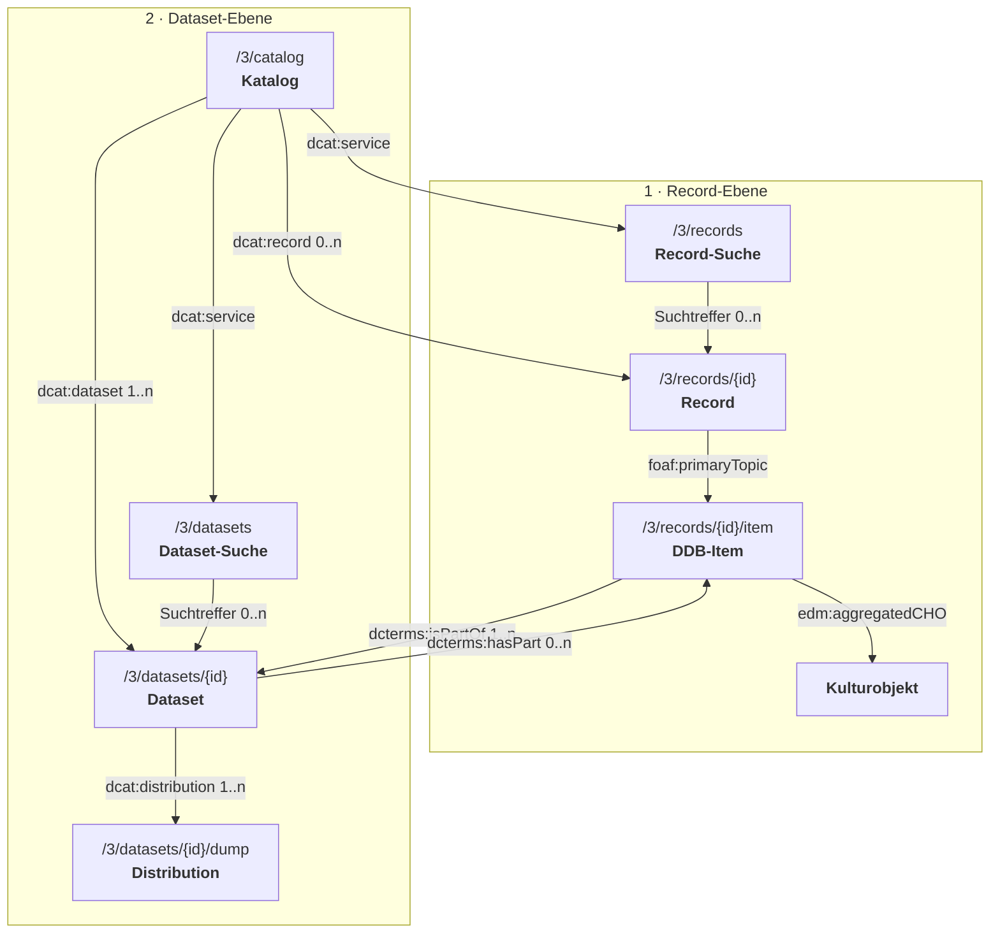

# Metadatenmodell der DDB API

Status: kompaktes fachliches Zielbild. Die Endpunkte sind Vorschläge;
HTTP-Methoden bleiben außen vor.

## 1. Das Modell in einem Bild



Die **Record-Suche** filtert öffentliche **Records**. Ein Record beschreibt
administrativ ein **DDB-Item**. Das DDB-Item bildet die Aggregation um ein
**Kulturobjekt**, verknüpft dessen fachliche EDM-Metadaten und kann zu mehreren
**Datasets** gehören. Der **Katalog** erschließt die öffentlichen Datasets. Die
**Dataset-Suche** filtert diese Datasets; **Distributions** machen ihre Daten
herunterladbar.

## 2. Begriffe und Dokumentationsschema

| Begriff | Verbindliche Bedeutung |
| --- | --- |
| **EDM** | Europeana Data Model für die fachlichen Metadaten eines Kulturobjekts. |
| **EDM-Anwendungsprofil** | Für die DDB verbindliche Auswahl und Validierungsregeln für EDM. |
| **Record-Suche** | `dcat:DataService`; API-Zugang zur gefilterten Suche nach öffentlichen Records. |
| **Record** | `dcat:CatalogRecord`; administrative Metadaten zu genau einem DDB-Item. |
| **DDB-Item** | `dcat:Resource` und `ore:Aggregation`; stabile DDB-Ressource, die ein Kulturobjekt aggregiert. |
| **Kulturobjekt** | `edm:ProvidedCHO`; das durch die fachlichen Metadaten beschriebene Objekt. |
| **Dataset** | `dcat:Dataset`; dauerhaft identifizierter Bestand von DDB-Items. |
| **Liefer-Dataset** | Dataset, das die DDB-Items einer Lieferung zusammenfasst. |
| **Katalog** | `dcat:Catalog`; erschließt alle öffentlichen Datasets. |
| **Dataset-Suche** | `dcat:DataService`; API-Zugang zur gefilterten Suche nach öffentlichen Datasets. |
| **Distribution** | `dcat:Distribution`; herunterladbare Repräsentation eines Datasets. |
| **Dump** | Durch ein Manifest erschlossene ZIP-Pakete einer Distribution. |
| **Provider (Datenpartner)** | Organisation, die Daten an die DDB liefert und den lokalen Quellidentifier vergeben hat; in der DDB auch Datenpartner genannt. |
| **Aggregator** | Organisation, die Daten mehrerer Provider zusammenführt. |
| **Quell-XML** | Unverändertes, vom Provider geliefertes XML-Dokument. |
| **Tombstone** | Reduzierter Record für ein nicht mehr ausgeliefertes DDB-Item. |

### Standardbasis und Ausnahmen

- Katalog, Datasets, Distributions und Datendienste folgen
  [DCAT-AP 3.0](https://semiceu.github.io/DCAT-AP/releases/3.0.0/) auf Basis
  von [DCAT 3](https://www.w3.org/TR/vocab-dcat-3/).
- Records und DDB-Items folgen einem DDB-Anwendungsprofil aus DCAT, ORE, ADMS
  und PROV; seine Regeln werden mit SHACL beschrieben. Dafür wird keine eigene
  DDB-Ontologie benötigt.
- Der fachliche Inhalt folgt dem DDB-EDM-Anwendungsprofil. Das Beispiel in
  dieser Dokumentation zeigt nur einen Ausschnitt und ist keine vollständige
  Europeana-Lieferung.
- Die direkte Typisierung des DDB-Items als `dcat:Resource` und
  `ore:Aggregation` ist eine bewusste Profilausnahme: DCAT empfiehlt für andere
  Ressourcentypen eine Unterklasse; die DDB vermeidet dafür eine eigene Klasse.
- Das Dump-Manifest ist als operative Ausnahme normales JSON. Alle fachlichen
  und beschreibenden Metadaten bleiben RDF.

Jeder folgende Abschnitt verwendet dasselbe Schema:

1. **API-Endpunkt** – technischer Zugriffspfad,
2. **Identität** – stabile IRI und RDF-Typ,
3. **Bedeutung** – fachliche Aufgabe,
4. **Beispiel** – JSON/JSON-LD oder RDF/XML.

## 3. Record-Suche

**API-Endpunkt:** `/3/records?q={suchbegriff}&limit={limit}&cursor={cursor}`

**Identität:** Der Dienst
`https://api.deutsche-digitale-bibliothek.de/services/records` ist vom Typ
`dcat:DataService`. Die Antwort ist eine gefilterte Teilbeschreibung des
Katalogs; jeder Treffer behält die IRI seines Records.

**Bedeutung:** Die rudimentäre, nicht zwischen Groß- und Kleinschreibung
unterscheidende Suche berücksichtigt die DDB-ID, den Quellidentifier und
indexierte fachliche Metadaten des DDB-Items. `q` ist optional, `limit` begrenzt
die Seite und `cursor` setzt sie fort. Ohne `q` werden alle öffentlichen Records
seitenweise ausgegeben. Die Treffer selbst enthalten nur administrative
Record-Metadaten.

**Beispiel:**

```json
{
  "@context": "https://api.deutsche-digitale-bibliothek.de/contexts/ddb-api-v1.jsonld",
  "@id": "https://api.deutsche-digitale-bibliothek.de/catalog",
  "@type": "dcat:Catalog",
  "record": [{
    "@id": "https://api.deutsche-digitale-bibliothek.de/records/ABCDEFGHIJKLMNOPQRSTUVWXYZ234567",
    "@type": "dcat:CatalogRecord",
    "primaryTopic": {
      "@id": "https://www.deutsche-digitale-bibliothek.de/item/ABCDEFGHIJKLMNOPQRSTUVWXYZ234567",
      "identifier": "ABCDEFGHIJKLMNOPQRSTUVWXYZ234567"
    },
    "modified": "2026-09-04T09:30:00Z"
  }, {
    "@id": "https://api.deutsche-digitale-bibliothek.de/records/ZYXWVUTSRQPONMLKJIHGFEDCBA765432",
    "@type": "dcat:CatalogRecord",
    "primaryTopic": {
      "@id": "https://www.deutsche-digitale-bibliothek.de/item/ZYXWVUTSRQPONMLKJIHGFEDCBA765432",
      "identifier": "ZYXWVUTSRQPONMLKJIHGFEDCBA765432"
    },
    "modified": "2026-09-03T14:20:00Z"
  }]
}
```

`record` ist wiederholbar; weitere Treffer können folgen: `...`. Ein Cursor für
die nächste Seite kann im HTTP-`Link`-Header stehen. Der Detailendpunkt eines
Treffers ist `/3/records/{recordId}`.

## 4. Record

**API-Endpunkt:** `/3/records/{recordId}`

**Identität:** `https://api.deutsche-digitale-bibliothek.de/records/{recordId}`
vom Typ `dcat:CatalogRecord`.

**Bedeutung:** Der Record enthält nur administrative Metadaten. Sein
`foaf:primaryTopic` ist das DDB-Item. Titel, Objekttyp, Provider, Aggregator und
andere fachliche Metadaten bleiben im RDF/EDM-Inhalt.

**Beispiel:**

```json
{
  "@context": "https://api.deutsche-digitale-bibliothek.de/contexts/ddb-api-v1.jsonld",
  "@id": "https://api.deutsche-digitale-bibliothek.de/records/ABCDEFGHIJKLMNOPQRSTUVWXYZ234567",
  "@type": "dcat:CatalogRecord",
  "conformsTo": "https://api.deutsche-digitale-bibliothek.de/profiles/record-metadata/ddb-v1",
  "primaryTopic": {
    "@id": "https://www.deutsche-digitale-bibliothek.de/item/ABCDEFGHIJKLMNOPQRSTUVWXYZ234567",
    "@type": [
      "dcat:Resource",
      "ore:Aggregation"
    ],
    "identifier": "ABCDEFGHIJKLMNOPQRSTUVWXYZ234567",
    "isPartOf": [
      "https://www.deutsche-digitale-bibliothek.de/dataset/ddb-gesamtbestand",
      "https://www.deutsche-digitale-bibliothek.de/dataset/BBBBBBBBBBBBBBBBBBBBBBBBBBBBBBBB",
      "https://www.deutsche-digitale-bibliothek.de/dataset/EEEEEEEEEEEEEEEEEEEEEEEEEEEEEEEE"
    ],
    "sourceIdentifier": {
      "@type": "adms:Identifier",
      "notation": "demo-001",
      "creator": "https://www.deutsche-digitale-bibliothek.de/organization/CCCCCCCCCCCCCCCCCCCCCCCCCCCCCCCC"
    },
    "conformsTo": "https://api.deutsche-digitale-bibliothek.de/profiles/edm/ddb-v3"
  },
  "issued": "2026-01-01T12:00:00Z",
  "modified": "2026-09-04T09:30:00Z"
}
```

`isPartOf` ist wiederholbar. Gezeigt sind der DDB-Gesamtbestand, das
verpflichtende Liefer-Dataset und ein weiteres Dataset; weitere Werte sind
möglich: `...`.

| Feld | RDF-Begriff | Bedeutung |
| --- | --- | --- |
| `primaryTopic` | `foaf:primaryTopic` | genau ein beschriebenes DDB-Item |
| `identifier` | `dcterms:identifier` | DDB-ID |
| `isPartOf` | `dcterms:isPartOf` | alle öffentlich sichtbaren Dataset-Zugehörigkeiten |
| `sourceIdentifier` | `adms:identifier` | genau ein lokaler Quellidentifier |
| `creator` | `dcterms:creator` | Provider, der den Quellidentifier vergeben hat |
| `conformsTo` | `dcterms:conformsTo` | am Record das Record-Metadatenprofil, am DDB-Item das EDM-Anwendungsprofil |
| `issued` | `dcterms:issued` | erstmalige Veröffentlichung des Records |
| `modified` | `dcterms:modified` | letzte Änderung des Records |

### Tombstone

Ein Tombstone ist eine Zustandsvariante desselben Records unter
`/3/records/{recordId}`. Die IRIs und RDF-Typen des Records und des DDB-Items
bleiben erhalten; der fachliche RDF/EDM-Inhalt wird nicht mehr ausgeliefert.
Der Item-Endpunkt antwortet mit HTTP `410`, eine unbekannte oder endgültig
entfernte Identität mit `404`.

```json
{
  "@context": "https://api.deutsche-digitale-bibliothek.de/contexts/ddb-api-v1.jsonld",
  "@id": "https://api.deutsche-digitale-bibliothek.de/records/ABCDEFGHIJKLMNOPQRSTUVWXYZ234567",
  "@type": "dcat:CatalogRecord",
  "conformsTo": "https://api.deutsche-digitale-bibliothek.de/profiles/record-metadata/ddb-v1",
  "primaryTopic": {
    "@id": "https://www.deutsche-digitale-bibliothek.de/item/ABCDEFGHIJKLMNOPQRSTUVWXYZ234567",
    "@type": [
      "dcat:Resource",
      "ore:Aggregation"
    ],
    "identifier": "ABCDEFGHIJKLMNOPQRSTUVWXYZ234567",
    "isPartOf": [
      "https://www.deutsche-digitale-bibliothek.de/dataset/ddb-gesamtbestand",
      "https://www.deutsche-digitale-bibliothek.de/dataset/BBBBBBBBBBBBBBBBBBBBBBBBBBBBBBBB",
      "https://www.deutsche-digitale-bibliothek.de/dataset/EEEEEEEEEEEEEEEEEEEEEEEEEEEEEEEE"
    ],
    "sourceIdentifier": {
      "@type": "adms:Identifier",
      "notation": "demo-001",
      "creator": "https://www.deutsche-digitale-bibliothek.de/organization/CCCCCCCCCCCCCCCCCCCCCCCCCCCCCCCC"
    },
    "invalidatedAtTime": "2026-09-04T12:00:00Z",
    "wasInvalidatedBy": {
      "@id": "https://api.deutsche-digitale-bibliothek.de/records/ABCDEFGHIJKLMNOPQRSTUVWXYZ234567#deletion",
      "@type": "prov:Activity",
      "type": "https://example.org/deletion-reasons/provider-request",
      "description": "Auf Wunsch des Providers entfernt."
    }
  },
  "issued": "2026-01-01T12:00:00Z",
  "modified": "2026-09-04T12:00:00Z"
}
```

Der Löschgrund klassifiziert die `prov:Activity`, nicht das DDB-Item. Das
kontrollierte Vokabular für Löschgründe ist separat festzulegen.

## 5. DDB-Item und Kulturobjekt

**API-Endpunkt:** `/3/records/{recordId}/item`

**Identitäten:**

- DDB-Item: `https://www.deutsche-digitale-bibliothek.de/item/{recordId}` vom
  Typ `dcat:Resource` und `ore:Aggregation`.
- Kulturobjekt: IRI aus dem RDF/EDM-Inhalt vom Typ `edm:ProvidedCHO`.

**Bedeutung:** Der Endpunkt liefert den fachlichen RDF/EDM-Inhalt. Das
DDB-Item verbindet das Kulturobjekt mit dessen Provider und weiteren
EDM-Ressourcen. Öffentliche Version-IRIs sind nicht vorgesehen. Das folgende
Beispiel zeigt nur die Kernbeziehung; eine vollständige Lieferung muss alle im
DDB-EDM-Anwendungsprofil vorgeschriebenen Ressourcen und Eigenschaften
enthalten.

**Beispiel:**

```xml
<?xml version="1.0" encoding="UTF-8"?>
<rdf:RDF
    xmlns:rdf="http://www.w3.org/1999/02/22-rdf-syntax-ns#"
    xmlns:dc="http://purl.org/dc/elements/1.1/"
    xmlns:edm="http://www.europeana.eu/schemas/edm/"
    xmlns:ore="http://www.openarchives.org/ore/terms/"
    xmlns:skos="http://www.w3.org/2004/02/skos/core#">

  <ore:Aggregation rdf:about="https://www.deutsche-digitale-bibliothek.de/item/ABCDEFGHIJKLMNOPQRSTUVWXYZ234567">
    <rdf:type rdf:resource="http://www.w3.org/ns/dcat#Resource"/>
    <edm:aggregatedCHO rdf:resource="https://provider.example/objects/demo-001"/>
    <edm:dataProvider rdf:resource="https://www.deutsche-digitale-bibliothek.de/organization/CCCCCCCCCCCCCCCCCCCCCCCCCCCCCCCC"/>
    <edm:provider rdf:resource="https://www.deutsche-digitale-bibliothek.de/organization/DDB"/>
  </ore:Aggregation>

  <edm:ProvidedCHO rdf:about="https://provider.example/objects/demo-001">
    <dc:title xml:lang="de">Beispielobjekt</dc:title>
    <dc:title xml:lang="en">Example object</dc:title>
  </edm:ProvidedCHO>

  <edm:Agent rdf:about="https://www.deutsche-digitale-bibliothek.de/organization/CCCCCCCCCCCCCCCCCCCCCCCCCCCCCCCC">
    <skos:prefLabel xml:lang="de">Beispielmuseum</skos:prefLabel>
  </edm:Agent>

  <edm:Agent rdf:about="https://www.deutsche-digitale-bibliothek.de/organization/DDB">
    <skos:prefLabel xml:lang="de">Deutsche Digitale Bibliothek</skos:prefLabel>
  </edm:Agent>
</rdf:RDF>
```

`dc:title` und weitere fachliche Eigenschaften können mehrfach vorkommen; im
vollständigen RDF/EDM-Inhalt können weitere Werte folgen: `...`.
`edm:dataProvider` bezeichnet den Provider beziehungsweise Datenpartner,
`edm:provider` den Aggregator.

## 6. Katalog

**API-Endpunkt:** `/3/catalog`

**Identität:** `https://api.deutsche-digitale-bibliothek.de/catalog` vom Typ
`dcat:Catalog`.

**Bedeutung:** Der Katalog erschließt die öffentlichen DDB-Items, Datasets und
Datendienste. Dazu gehören der DDB-Gesamtbestand, Liefer-Datasets sowie
dynamische und kuratierte Datasets. Datasets werden mit `dcat:dataset`,
Datendienste mit `dcat:service` und Records seitenweise mit `dcat:record`
verknüpft. Der Katalog enthält deshalb keine vollständige Liste aller Records.

**Beispiel:**

```json
{
  "@context": "https://api.deutsche-digitale-bibliothek.de/contexts/ddb-api-v1.jsonld",
  "@id": "https://api.deutsche-digitale-bibliothek.de/catalog",
  "@type": "dcat:Catalog",
  "title": "Katalog der öffentlichen DDB-Ressourcen",
  "description": "Einstiegspunkt zu öffentlichen DDB-Items, Datasets und Datendiensten.",
  "publisher": {
    "@id": "https://www.deutsche-digitale-bibliothek.de/organization/DDB",
    "@type": "foaf:Agent",
    "name": "Deutsche Digitale Bibliothek"
  },
  "conformsTo": "https://semiceu.github.io/DCAT-AP/releases/3.0.0/",
  "issued": "2026-01-01T00:00:00Z",
  "modified": "2026-09-04T08:00:00Z",
  "dataset": [
    "https://www.deutsche-digitale-bibliothek.de/dataset/ddb-gesamtbestand",
    "https://www.deutsche-digitale-bibliothek.de/dataset/EEEEEEEEEEEEEEEEEEEEEEEEEEEEEEEE"
  ],
  "service": [{
    "@id": "https://api.deutsche-digitale-bibliothek.de/services/records",
    "@type": "dcat:DataService",
    "title": "DDB-Record-Suche",
    "conformsTo": "https://semiceu.github.io/DCAT-AP/releases/3.0.0/",
    "endpointURL": "https://api.deutsche-digitale-bibliothek.de/3/records"
  }, {
    "@id": "https://api.deutsche-digitale-bibliothek.de/services/datasets",
    "@type": "dcat:DataService",
    "title": "DDB-Dataset-Suche",
    "conformsTo": "https://semiceu.github.io/DCAT-AP/releases/3.0.0/",
    "endpointURL": "https://api.deutsche-digitale-bibliothek.de/3/datasets"
  }]
}
```

`dataset`, `service` und `record` sind wiederholbar; weitere Werte können
folgen: `...`. Nicht öffentliche Ressourcen erscheinen nicht im öffentlichen
Katalog.

## 7. Dataset-Suche

**API-Endpunkt:** `/3/datasets?q={suchbegriff}&limit={limit}&cursor={cursor}`

**Identität:** Der Dienst
`https://api.deutsche-digitale-bibliothek.de/services/datasets` ist vom Typ
`dcat:DataService`. Die Antwort ist eine gefilterte Teilbeschreibung des
Katalogs; jeder Treffer behält die IRI seines Datasets.

**Bedeutung:** Die rudimentäre, nicht zwischen Groß- und Kleinschreibung
unterscheidende Suche berücksichtigt `identifier`, `title` und `description`
öffentlicher Datasets. `q` ist optional, `limit` begrenzt die Seite und
`cursor` setzt sie fort. Ohne `q` werden alle öffentlichen Datasets
seitenweise ausgegeben.

**Beispiel:**

```json
{
  "@context": "https://api.deutsche-digitale-bibliothek.de/contexts/ddb-api-v1.jsonld",
  "@id": "https://api.deutsche-digitale-bibliothek.de/catalog",
  "@type": "dcat:Catalog",
  "dataset": [{
    "@id": "https://www.deutsche-digitale-bibliothek.de/dataset/ddb-gesamtbestand",
    "@type": "dcat:Dataset",
    "identifier": "ddb-gesamtbestand",
    "title": "DDB-Gesamtbestand",
    "description": "Alle öffentlich verfügbaren DDB-Items."
  }, {
    "@id": "https://www.deutsche-digitale-bibliothek.de/dataset/EEEEEEEEEEEEEEEEEEEEEEEEEEEEEEEE",
    "@type": "dcat:Dataset",
    "identifier": "EEEEEEEEEEEEEEEEEEEEEEEEEEEEEEEE",
    "title": "Veröffentlichte Bildobjekte des 19. Jahrhunderts",
    "description": "Dynamisch gebildeter Bestand veröffentlichter Bildobjekte mit einer Datierung im 19. Jahrhundert."
  }]
}
```

`dataset` ist wiederholbar; weitere Treffer können folgen: `...`. Ein Cursor für
die nächste Seite kann im HTTP-`Link`-Header stehen. Der Detailendpunkt eines
Treffers ist `/3/datasets/{datasetId}`.

## 8. Dataset

**API-Endpunkt:** `/3/datasets/{datasetId}`

**Identität:**
`https://www.deutsche-digitale-bibliothek.de/dataset/{datasetId}` vom Typ
`dcat:Dataset`.

**Bedeutung:** Ein Dataset ist ein stabiler logischer Bestand. Jedes
öffentliche DDB-Item gehört zum DDB-Gesamtbestand und mindestens zum Dataset
seiner Lieferung; weitere dynamische oder kuratierte Datasets sind möglich.
Ein technischer Import ist kein Dataset.

**Beispiel:**

```json
{
  "@context": "https://api.deutsche-digitale-bibliothek.de/contexts/ddb-api-v1.jsonld",
  "@id": "https://www.deutsche-digitale-bibliothek.de/dataset/EEEEEEEEEEEEEEEEEEEEEEEEEEEEEEEE",
  "@type": "dcat:Dataset",
  "identifier": "EEEEEEEEEEEEEEEEEEEEEEEEEEEEEEEE",
  "title": "Veröffentlichte Bildobjekte des 19. Jahrhunderts",
  "description": "Dynamisch gebildeter Bestand veröffentlichter Bildobjekte mit einer Datierung im 19. Jahrhundert.",
  "conformsTo": "https://semiceu.github.io/DCAT-AP/releases/3.0.0/",
  "issued": "2026-01-01T12:00:00Z",
  "modified": "2026-08-15T10:00:00Z",
  "publisher": {
    "@id": "https://www.deutsche-digitale-bibliothek.de/organization/DDB",
    "@type": "foaf:Agent",
    "name": "Deutsche Digitale Bibliothek"
  },
  "license": "https://creativecommons.org/publicdomain/zero/1.0/",
  "distribution": [{
    "@id": "https://api.deutsche-digitale-bibliothek.de/datasets/EEEEEEEEEEEEEEEEEEEEEEEEEEEEEEEE/distributions/xml/current",
    "@type": "dcat:Distribution",
    "title": "EDM-Daten als RDF/XML",
    "conformsTo": "https://api.deutsche-digitale-bibliothek.de/profiles/edm/ddb-v3",
    "accessURL": "https://api.deutsche-digitale-bibliothek.de/3/datasets/EEEEEEEEEEEEEEEEEEEEEEEEEEEEEEEE/dump",
    "mediaType": "https://www.iana.org/assignments/media-types/application/rdf+xml",
    "packageFormat": "https://www.iana.org/assignments/media-types/application/zip",
    "modified": "2026-09-04T03:00:00Z"
  }, {
    "@id": "https://api.deutsche-digitale-bibliothek.de/datasets/EEEEEEEEEEEEEEEEEEEEEEEEEEEEEEEE/distributions/source/current",
    "@type": "dcat:Distribution",
    "title": "Optionale Quell-XML-Dokumente",
    "accessURL": "https://api.deutsche-digitale-bibliothek.de/3/datasets/EEEEEEEEEEEEEEEEEEEEEEEEEEEEEEEE/source-dump",
    "mediaType": "https://www.iana.org/assignments/media-types/application/xml",
    "packageFormat": "https://www.iana.org/assignments/media-types/application/zip",
    "modified": "2026-09-04T03:00:00Z"
  }]
}
```

`distribution` ist wiederholbar. RDF/XML ist die primäre Distribution;
Quell-XML ist optional. Weitere Repräsentationen können folgen: `...`.
N-Quads kann bei Bedarf eine solche zusätzliche Distribution sein.

Die Dataset-Metadaten enthalten keine Mitgliederliste. `modified` ändert sich
bei einer Änderung der Beschreibung oder Auswahlregel, nicht bei jeder neu
berechneten Mitgliedschaft.

### Dataset-Mitglieder

**API-Endpunkt:**
`/3/datasets/{datasetId}/items?limit={limit}&cursor={cursor}`

Der Endpunkt liefert seitenweise die vorwärts gerichteten
`dcterms:hasPart`-Aussagen des Datasets. Zusammen mit `dcterms:isPartOf` am
DDB-Item sind damit beide Beziehungsrichtungen verfügbar, ohne die
Dataset-Metadaten mit Millionen Mitgliedern zu belasten.

```json
{
  "@context": "https://api.deutsche-digitale-bibliothek.de/contexts/ddb-api-v1.jsonld",
  "@id": "https://www.deutsche-digitale-bibliothek.de/dataset/EEEEEEEEEEEEEEEEEEEEEEEEEEEEEEEE",
  "@type": "dcat:Dataset",
  "hasPart": [
    "https://www.deutsche-digitale-bibliothek.de/item/ABCDEFGHIJKLMNOPQRSTUVWXYZ234567",
    "https://www.deutsche-digitale-bibliothek.de/item/ZYXWVUTSRQPONMLKJIHGFEDCBA765432"
  ]
}
```

`hasPart` ist wiederholbar; weitere Mitglieder und Seiten können folgen: `...`.
Der Cursor für die nächste Seite kann im HTTP-`Link`-Header stehen.

Der DDB-Gesamtbestand ist das reguläre Dataset
`/3/datasets/ddb-gesamtbestand`; sein Dump liegt entsprechend unter
`/3/datasets/ddb-gesamtbestand/dump`.

## 9. Dataset-Dump

**API-Endpunkt:** `/3/datasets/{datasetId}/dump`

**Identität:** Der Endpunkt erschließt die aktuelle primäre Distribution des
Datasets. Die Distribution besitzt die in den Dataset-Metadaten angegebene
stabile IRI.

**Bedeutung:** Der Endpunkt liefert ein JSON-Manifest. Es verweist auf
ZIP-Pakete; jede darin enthaltene XML-Datei ist ein eigenständig parsebarer
RDF/XML-Inhalt genau eines DDB-Items. Das Manifest ist bewusst operatives JSON
und keine RDF-Repräsentation; Dataset und Distribution sind bereits
standardkonform in den Dataset-Metadaten beschrieben.

**Beispiel:**

```json
{
  "dataset": "https://www.deutsche-digitale-bibliothek.de/dataset/EEEEEEEEEEEEEEEEEEEEEEEEEEEEEEEE",
  "distribution": "https://api.deutsche-digitale-bibliothek.de/datasets/EEEEEEEEEEEEEEEEEEEEEEEEEEEEEEEE/distributions/xml/current",
  "created": "2026-09-04T03:00:00Z",
  "itemCount": 100000,
  "parts": [{
    "downloadURL": "https://api.deutsche-digitale-bibliothek.de/3/datasets/EEEEEEEEEEEEEEEEEEEEEEEEEEEEEEEE/dump/part-00001.zip",
    "itemCount": 50000,
    "byteSize": 2147483648,
    "sha256": "0123456789abcdef0123456789abcdef0123456789abcdef0123456789abcdef"
  }, {
    "downloadURL": "https://api.deutsche-digitale-bibliothek.de/3/datasets/EEEEEEEEEEEEEEEEEEEEEEEEEEEEEEEE/dump/part-00002.zip",
    "itemCount": 50000,
    "byteSize": 1987654321,
    "sha256": "abcdef0123456789abcdef0123456789abcdef0123456789abcdef0123456789"
  }]
}
```

`parts` ist wiederholbar; weitere ZIP-Pakete folgen: `...`. Dateinamen innerhalb
eines Pakets werden aus der DDB-ID und der Endung `.xml` gebildet.

## 10. Context

**API-Endpunkt:** `/contexts/ddb-api-v1.jsonld`

**Identität:** Die URL des Contexts ist versioniert und nach Veröffentlichung
unveränderlich.

**Bedeutung:** Der Context bildet die kurzen Feldnamen aller JSON-LD-Beispiele
auf vorhandene RDF-Begriffe ab. Er definiert keine DDB-Ontologie.

**Beispiel:**

```json
{
  "@context": {
    "@version": 1.1,
    "dcat": "http://www.w3.org/ns/dcat#",
    "dcterms": "http://purl.org/dc/terms/",
    "foaf": "http://xmlns.com/foaf/0.1/",
    "ore": "http://www.openarchives.org/ore/terms/",
    "adms": "http://www.w3.org/ns/adms#",
    "skos": "http://www.w3.org/2004/02/skos/core#",
    "prov": "http://www.w3.org/ns/prov#",
    "xsd": "http://www.w3.org/2001/XMLSchema#",

    "primaryTopic": "foaf:primaryTopic",
    "identifier": "dcterms:identifier",
    "record": {
      "@id": "dcat:record",
      "@container": "@set"
    },
    "isPartOf": {
      "@id": "dcterms:isPartOf",
      "@type": "@id",
      "@container": "@set"
    },
    "hasPart": {
      "@id": "dcterms:hasPart",
      "@type": "@id",
      "@container": "@set"
    },
    "sourceIdentifier": "adms:identifier",
    "notation": { "@id": "skos:notation", "@type": "xsd:string" },
    "creator": { "@id": "dcterms:creator", "@type": "@id" },
    "conformsTo": { "@id": "dcterms:conformsTo", "@type": "@id" },
    "issued": { "@id": "dcterms:issued", "@type": "xsd:dateTime" },
    "modified": { "@id": "dcterms:modified", "@type": "xsd:dateTime" },
    "invalidatedAtTime": {
      "@id": "prov:invalidatedAtTime",
      "@type": "xsd:dateTime"
    },
    "wasInvalidatedBy": "prov:wasInvalidatedBy",
    "type": { "@id": "dcterms:type", "@type": "@id" },
    "title": "dcterms:title",
    "description": "dcterms:description",
    "name": "foaf:name",
    "publisher": { "@id": "dcterms:publisher", "@type": "@id" },
    "license": { "@id": "dcterms:license", "@type": "@id" },

    "dataset": {
      "@id": "dcat:dataset",
      "@type": "@id",
      "@container": "@set"
    },
    "service": {
      "@id": "dcat:service",
      "@container": "@set"
    },
    "endpointURL": { "@id": "dcat:endpointURL", "@type": "@id" },
    "distribution": {
      "@id": "dcat:distribution",
      "@container": "@set"
    },
    "accessURL": { "@id": "dcat:accessURL", "@type": "@id" },
    "mediaType": { "@id": "dcat:mediaType", "@type": "@id" },
    "packageFormat": { "@id": "dcat:packageFormat", "@type": "@id" }
  }
}
```

`@container: "@set"` hält wiederholbare Felder auch bei genau einem Wert als
Array stabil.

## 11. Ergänzende API-Endpunkte

| API-Endpunkt | Inhalt |
| --- | --- |
| `/3/records/{recordId}/source` | Quell-XML |
| `/3/records/{recordId}/representations` | verfügbare Repräsentationen als JSON |
| `/3/datasets/{datasetId}/dump/{part}.zip` | RDF/XML-Teilpaket eines Dataset-Dumps |
| `/3/datasets/{datasetId}/source-dump` | Manifest der optionalen Quell-XML-Distribution |
| `/3/datasets/{datasetId}/source-dump/{part}.zip` | Quell-XML-Teilpaket |
| `/profiles/record-metadata/ddb-v1` | DDB-Record-Metadatenprofil und SHACL-Regeln |
| `/profiles/edm/ddb-v3` | DDB-EDM-Anwendungsprofil und SHACL-Regeln |
| `/contexts/ddb-api-v1.jsonld` | gemeinsamer JSON-LD-Context |
| `/openapi/openapi.yaml` | formaler API-Vertrag |

## 12. Externe Spezifikationen

- [DCAT 3](https://www.w3.org/TR/vocab-dcat-3/)
- [DCAT-AP 3.0](https://semiceu.github.io/DCAT-AP/releases/3.0.0/)
- [JSON-LD 1.1](https://www.w3.org/TR/json-ld11/)
- [RDF/XML 1.1](https://www.w3.org/TR/rdf-syntax-grammar/)
- [DCMI Metadata Terms](https://www.dublincore.org/specifications/dublin-core/dcmi-terms/)
- [OAI-ORE Abstract Data Model](https://www.openarchives.org/ore/1.0/datamodel)
- [Europeana Data Model – Definition](https://pro.europeana.eu/files/Europeana_Professional/Share_your_data/Technical_requirements/EDM_Documentation/EDM_Definition_v5.2.8_102017.pdf)
- [PROV-O](https://www.w3.org/TR/prov-o/)
- [ADMS](https://www.w3.org/TR/vocab-adms/)
- [SHACL](https://www.w3.org/TR/shacl/)
- [OpenAPI Specification](https://spec.openapis.org/oas/latest.html)
