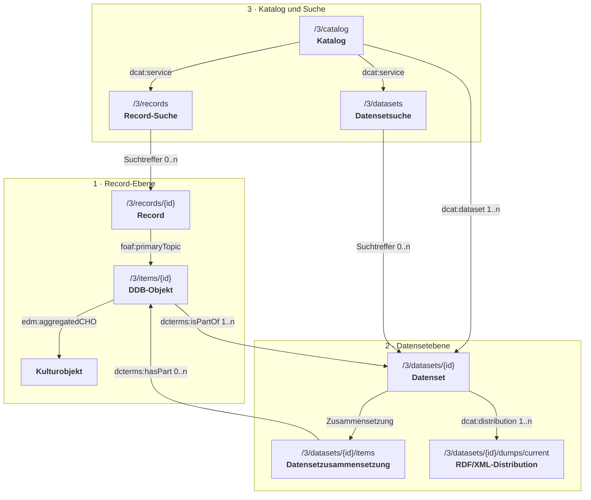

# Metadatenmodell der DDB-API v3

## 1. Das Modell in einem Bild



## 2. Begriffe und Dokumentationsschema

| Begriff                      | Verbindliche Bedeutung                                                                                    |
| ---------------------------- | --------------------------------------------------------------------------------------------------------- |
| **Aggregator**               | Organisation, die Daten mehrerer Datenpartner zusammenführt.                                              |
| **Datenset**                 | `dcat:Dataset`; dauerhaft identifizierter Bestand von DDB-Objekten.                                       |
| **Datensetsuche**            | `dcat:DataService`; API-Zugang zur gefilterten Suche nach öffentlichen Datensets.                         |
| **DDB-EDM-Anwendungsprofil** | Extern gepflegtes Regelwerk für die fachlichen EDM-Daten einschließlich verbindlicher Validierungsregeln. |
| **DDB-Objekt**               | `dcat:Resource` und `ore:Aggregation`; stabile DDB-Ressource, die ein Kulturobjekt aggregiert.            |
| **Distribution**             | `dcat:Distribution`; herunterladbare Repräsentation eines Datensets.                                      |
| **Dump**                     | Durch ein Manifest erschlossene ZIP-Pakete einer Distribution.                                            |
| **EDM**                      | Europeana Data Model für die fachlichen Metadaten eines Kulturobjekts.                                    |
| **Katalog**                  | `dcat:Catalog`; erschließt alle öffentlichen Datensets.                                                   |
| **Kulturobjekt**             | `edm:ProvidedCHO`; das durch die fachlichen Metadaten beschriebene Objekt.                                |
| **Lieferdatenset**           | Datenset, das die DDB-Objekte einer Lieferung zusammenfasst.                                              |
| **Datenpartner (Provider)**  | Organisation, die Daten an die DDB liefert und den lokalen Quellidentifier vergeben hat.                  |
| **Record**                   | `dcat:CatalogRecord`; administrative Metadaten zu genau einem DDB-Objekt.                                 |
| **Record-Metadatenprofil**   | Regelwerk für Struktur, Pflichtangaben und zulässige Werte der administrativen Record-Metadaten.          |
| **Record-Suche**             | `dcat:DataService`; API-Zugang zur gefilterten Suche nach öffentlichen Records.                           |
| **Source-XML**               | Unverändertes, vom Datenpartner geliefertes XML-Dokument.                                                 |
| **Tombstone**                | Reduzierter Record für ein nicht mehr ausgeliefertes DDB-Objekt.                                          |

### Standardbasis und Ausnahmen

- Katalog, Datensets, Distributions und Datendienste folgen
  [DCAT-AP 3.0](https://semiceu.github.io/DCAT-AP/releases/3.0.0/) auf Basis
  von [DCAT 3](https://www.w3.org/TR/vocab-dcat-3/).
- Das Record-Metadatenprofil verwendet DCAT, ORE, ADMS und PROV; seine Regeln
 sollen mit SHACL beschrieben werden. Es wird keine eigene DDB-Ontologie benötigt.
- Für fachliche Daten gilt das DDB-EDM-Anwendungsprofil (Abschnitt 4).
- Die direkte Typisierung des DDB-Objekts als `dcat:Resource` und
  `ore:Aggregation` ist eine bewusste Profilausnahme: DCAT empfiehlt für andere
  Ressourcentypen eine Unterklasse; die DDB vermeidet dafür eine eigene Klasse.
- Das Dump-Manifest ist als operative Ausnahme normales JSON. Alle fachlichen
  und beschreibenden Metadaten bleiben RDF.

Die Endpunkte werden mit Zugriffspfad, Identität (IRI und RDF-Typ), Bedeutung
und Beispiel beschrieben.

### Stabile IRIs und Auflösung

Records, Katalog, Datendienste und Distributions werden unter
`https://api.deutsche-digitale-bibliothek.de/` identifiziert, DDB-Objekte,
Datensets und Datenpartner unter `https://www.deutsche-digitale-bibliothek.de/`.
Veröffentlichte Ressourcen-IRIs bleiben auch bei einem API-Versionswechsel
stabil und dauerhaft auflösbar. `303 See Other` verweist auf ihre Beschreibung,
ohne ihre Identität zu ändern.

| Versionlose IRI                                                 | Auflösung                                                                                |
| --------------------------------------------------------------- | ---------------------------------------------------------------------------------------- |
| `https://api.deutsche-digitale-bibliothek.de/records/{id}`      | `303` auf `/3/records/{id}`                                                              |
| `https://api.deutsche-digitale-bibliothek.de/catalog`           | `303` auf `/3/catalog`                                                                   |
| `https://api.deutsche-digitale-bibliothek.de/services/records`  | `303` auf `/3/catalog`; dort steht die Dienstbeschreibung mit `dcat:endpointURL`         |
| `https://api.deutsche-digitale-bibliothek.de/services/datasets` | `303` auf `/3/catalog`; dort steht die Dienstbeschreibung mit `dcat:endpointURL`         |
| `https://www.deutsche-digitale-bibliothek.de/dataset/{id}`      | `303` auf `/3/datasets/{id}`; eine separate HTML-Beschreibung kann später ergänzt werden |
| `https://www.deutsche-digitale-bibliothek.de/item/{id}`         | HTML direkt; bei `Accept: application/rdf+xml` erfolgt `303` auf `/3/items/{id}`         |

Die Zielpfade beziehen sich auf `https://api.deutsche-digitale-bibliothek.de`.
Vom `Accept`-Header abhängige Antworten tragen `Vary: Accept`.
Die direkte HTML-Auslieferung unter der IRI des DDB-Objekts ist eine bewusste
Modellierungsunschärfe aus Kompatibilitätsgründen. Die semantisch klarere
Alternative wäre eine separate HTML-Dokumentadresse mit ebenfalls `303`
von der IRI des DDB-Objekts.

## 3. Record

**API-Endpunkt:** `/3/records/{recordId}`

**Identität:** `https://api.deutsche-digitale-bibliothek.de/records/{recordId}`
vom Typ `dcat:CatalogRecord`.

**Bedeutung:** Ein Record ist die administrative Beschreibung genau eines
DDB-Objekts. Sein
`foaf:primaryTopic` ist das DDB-Objekt. Fachliche Metadaten bleiben im RDF/EDM-Inhalt;
der Datenpartner wird hier ausschließlich als Vergabestelle des Quellidentifiers
referenziert. Reguläre Änderungen werden über `modified` kenntlich gemacht;
ein öffentlicher Nachweis der auslösenden Vorgänge ist nicht vorgesehen.
Records und DDB-Objekte werden im aktuellen Stand beziehungsweise als Tombstone
bereitgestellt. Frühere Einzelstände sind nicht öffentlich abrufbar.

**Beispiel:**

```json
{
  "@context": "https://api.deutsche-digitale-bibliothek.de/contexts/ddb-api-v1.jsonld",
  "@id": "https://api.deutsche-digitale-bibliothek.de/records/ABCDEFGHIJKLMNOPQRSTUVWXYZ234567",
  "@type": "dcat:CatalogRecord",
  "recordProfile": "https://api.deutsche-digitale-bibliothek.de/profiles/record-metadata/ddb-v1",
  "primaryTopic": {
    "@id": "https://www.deutsche-digitale-bibliothek.de/item/ABCDEFGHIJKLMNOPQRSTUVWXYZ234567",
    "@type": [
      "dcat:Resource",
      "ore:Aggregation"
    ],
    "identifier": "ABCDEFGHIJKLMNOPQRSTUVWXYZ234567",
    "isPartOf": [
      "https://www.deutsche-digitale-bibliothek.de/dataset/BBBBBBBBBBBBBBBBBBBBBBBBBBBBBBBB",
      "https://www.deutsche-digitale-bibliothek.de/dataset/EEEEEEEEEEEEEEEEEEEEEEEEEEEEEEEE"
    ],
    "sourceIdentifier": {
      "@type": "adms:Identifier",
      "notation": "demo-001",
      "creator": "https://www.deutsche-digitale-bibliothek.de/organization/CCCCCCCCCCCCCCCCCCCCCCCCCCCCCCCC"
    },
    "edmProfile": "https://api.deutsche-digitale-bibliothek.de/profiles/edm/ddb-v3"
  },
  "issued": "2026-01-01T12:00:00Z",
  "modified": "2026-09-04T09:30:00Z"
}
```

`isPartOf` ist wiederholbar. Gezeigt sind der DDB-Gesamtbestand, das
verpflichtende Lieferdatenset und ein weiteres Datenset.

| Feld               | RDF-Begriff          | Bedeutung                                                                                   |
| ------------------ | -------------------- | ------------------------------------------------------------------------------------------- |
| `primaryTopic`     | `foaf:primaryTopic`  | genau ein beschriebenes DDB-Objekt                                                          |
| `identifier`       | `dcterms:identifier` | DDB-ID                                                                                      |
| `isPartOf`         | `dcterms:isPartOf`   | alle öffentlich sichtbaren Datensetzugehörigkeiten                                          |
| `sourceIdentifier` | `adms:identifier`    | genau ein Objekt vom Typ `adms:Identifier` mit lokaler Kennung und vergebendem Datenpartner |
| `notation`         | `skos:notation`      | lokale Kennung innerhalb von `adms:Identifier`                                              |
| `creator`          | `dcterms:creator`    | Datenpartner, der den Quellidentifier vergeben hat                                          |
| `recordProfile`    | `dcterms:conformsTo` | am Record: verbindliche Version des Record-Metadatenprofils                                 |
| `edmProfile`       | `dcterms:conformsTo` | am DDB-Objekt: verbindliche Version des extern gepflegten DDB-EDM-Anwendungsprofils         |
| `issued`           | `dcterms:issued`     | erstmalige Veröffentlichung des Records                                                     |
| `modified`         | `dcterms:modified`   | letzte Änderung des Records                                                                 |

### Tombstone

**API-Endpunkt:** `/3/records/{recordId}`

**Identität:** Dieselbe Record-IRI vom Typ `dcat:CatalogRecord` wie beim aktiven
Record. Auch IRI und RDF-Typen des DDB-Objekts bleiben erhalten.

**Bedeutung:** Ein Tombstone ist ein reduzierter Record für ein nicht mehr
ausgeliefertes DDB-Objekt. Er bleibt als administrativer Nachweis abrufbar.
Der fachliche RDF/EDM-Inhalt entfällt: Der DDB-Objekt-Endpunkt antwortet mit HTTP `410`,
bei unbekannter oder endgültig entfernter Identität mit `404`.

`prov:invalidatedAtTime` und `prov:wasInvalidatedBy` stehen am DDB-Objekt unter
`foaf:primaryTopic`. Invalidiert wird die bereitgestellte Aggregation;
über den Fortbestand des Kulturobjekts wird keine Aussage getroffen.

**Beispiel:**

```json
{
  "@context": "https://api.deutsche-digitale-bibliothek.de/contexts/ddb-api-v1.jsonld",
  "@id": "https://api.deutsche-digitale-bibliothek.de/records/ABCDEFGHIJKLMNOPQRSTUVWXYZ234567",
  "@type": "dcat:CatalogRecord",
  "recordProfile": "https://api.deutsche-digitale-bibliothek.de/profiles/record-metadata/ddb-v1",
  "primaryTopic": {
    "@id": "https://www.deutsche-digitale-bibliothek.de/item/ABCDEFGHIJKLMNOPQRSTUVWXYZ234567",
    "@type": [
      "dcat:Resource",
      "ore:Aggregation"
    ],
    "identifier": "ABCDEFGHIJKLMNOPQRSTUVWXYZ234567",
    "isPartOf": [
      "https://www.deutsche-digitale-bibliothek.de/dataset/ddb-gesamtbestand",
      "https://www.deutsche-digitale-bibliothek.de/dataset/BBBBBBBBBBBBBBBBBBBBBBBBBBBBBBBB",
      "https://www.deutsche-digitale-bibliothek.de/dataset/EEEEEEEEEEEEEEEEEEEEEEEEEEEEEEEE"
    ],
    "sourceIdentifier": {
      "@type": "adms:Identifier",
      "notation": "demo-001",
      "creator": "https://www.deutsche-digitale-bibliothek.de/organization/CCCCCCCCCCCCCCCCCCCCCCCCCCCCCCCC"
    },
    "invalidatedAtTime": "2026-09-04T12:00:00Z",
    "wasInvalidatedBy": {
      "@id": "https://api.deutsche-digitale-bibliothek.de/records/ABCDEFGHIJKLMNOPQRSTUVWXYZ234567#deletion",
      "@type": "prov:Activity",
      "type": "http://ddb.vocnet.org/loeschgrund/lg001",
      "description": "Auf Wunsch des Datenpartners entfernt."
    }
  },
  "issued": "2026-01-01T12:00:00Z",
  "modified": "2026-09-04T12:00:00Z"
}
```

Pflichtangabe ist ein kontrollierter Löschgrund als `dcterms:type` an der
`prov:Activity`: eine stabile IRI aus dem in xTree gepflegten DDB-Vokabular.
Das Record-Metadatenprofil legt die zulässigen Begriffe fest, einschließlich
eines neutralen Begriffs, falls keine nähere öffentliche Angabe möglich ist.
Eine ergänzende SKOS-Veröffentlichung wird angestrebt.

Das Löschgrundvokabular einschließlich seiner IRIs ist noch festzulegen;
`http://ddb.vocnet.org/loeschgrund/lg001` ist eine bisher fiktive xTree-Begriffs-IRI
für „Auf Wunsch des Datenpartners entfernt“.

## 4. DDB-Objekt und Kulturobjekt

**API-Endpunkt:** `/3/items/{id}`

**Identitäten:**

- DDB-Objekt: `https://www.deutsche-digitale-bibliothek.de/item/{id}` vom
  Typ `dcat:Resource` und `ore:Aggregation`.
- Kulturobjekt: IRI aus dem RDF/EDM-Inhalt vom Typ `edm:ProvidedCHO`.

**Bedeutung:** Ein DDB-Objekt ist die stabile Aggregation um ein Kulturobjekt;
das Kulturobjekt ist das durch die fachlichen Metadaten beschriebene Objekt.
Der Endpunkt liefert den RDF/EDM-Inhalt, der beide mit dem Datenpartner und weiteren
EDM-Ressourcen verknüpft. Die ausgelieferten Daten entsprechen dem über `edmProfile`
referenzierten, extern gepflegten DDB-EDM-Anwendungsprofil einschließlich
seiner verbindlichen SHACL-Regeln. Das folgende Beispiel zeigt nur die
Kernbeziehung und ist kein vollständiges Validierungsbeispiel.

**Beispiel:**

```xml
<?xml version="1.0" encoding="UTF-8"?>
<rdf:RDF
    xmlns:rdf="http://www.w3.org/1999/02/22-rdf-syntax-ns#"
    xmlns:dc="http://purl.org/dc/elements/1.1/"
    xmlns:dcterms="http://purl.org/dc/terms/"
    xmlns:edm="http://www.europeana.eu/schemas/edm/"
    xmlns:ore="http://www.openarchives.org/ore/terms/"
    xmlns:skos="http://www.w3.org/2004/02/skos/core#">

  <ore:Aggregation rdf:about="https://www.deutsche-digitale-bibliothek.de/item/ABCDEFGHIJKLMNOPQRSTUVWXYZ234567">
    <rdf:type rdf:resource="http://www.w3.org/ns/dcat#Resource"/>
    <dcterms:conformsTo rdf:resource="https://api.deutsche-digitale-bibliothek.de/profiles/edm/ddb-v3"/>
    <edm:aggregatedCHO rdf:resource="https://provider.example/objects/demo-001"/>
    <edm:dataProvider rdf:resource="https://www.deutsche-digitale-bibliothek.de/organization/CCCCCCCCCCCCCCCCCCCCCCCCCCCCCCCC"/>
    <edm:provider rdf:resource="https://www.deutsche-digitale-bibliothek.de/organization/DDB"/>
  </ore:Aggregation>

  <edm:ProvidedCHO rdf:about="https://provider.example/objects/demo-001">
    <dc:title xml:lang="de">Beispielobjekt</dc:title>
    <dc:title xml:lang="en">Example object</dc:title>
  </edm:ProvidedCHO>

  <edm:Agent rdf:about="https://www.deutsche-digitale-bibliothek.de/organization/CCCCCCCCCCCCCCCCCCCCCCCCCCCCCCCC">
    <skos:prefLabel xml:lang="de">Beispielmuseum</skos:prefLabel>
  </edm:Agent>

  <edm:Agent rdf:about="https://www.deutsche-digitale-bibliothek.de/organization/DDB">
    <skos:prefLabel xml:lang="de">Deutsche Digitale Bibliothek</skos:prefLabel>
  </edm:Agent>
</rdf:RDF>
```

`dc:title` und weitere fachliche Eigenschaften sind wiederholbar.
`edm:dataProvider` bezeichnet den Provider beziehungsweise Datenpartner,
`edm:provider` den Aggregator.

## 5. Datenset

**API-Endpunkt:** `/3/datasets/{datasetId}`

**Identität:**
`https://www.deutsche-digitale-bibliothek.de/dataset/{datasetId}` vom Typ
`dcat:Dataset`.

**Bedeutung:** Ein Datenset ist ein dauerhaft identifizierter logischer Bestand von
DDB-Objekten. Jedes
öffentliche DDB-Objekt gehört zum DDB-Gesamtbestand und mindestens zum Datenset
seiner Lieferung; weitere dynamische oder kuratierte Datensets sind möglich.
Ein technischer Import ist kein Datenset.

**Beispiel:**

```json
{
  "@context": "https://api.deutsche-digitale-bibliothek.de/contexts/ddb-api-v1.jsonld",
  "@id": "https://www.deutsche-digitale-bibliothek.de/dataset/EEEEEEEEEEEEEEEEEEEEEEEEEEEEEEEE",
  "@type": "dcat:Dataset",
  "identifier": "EEEEEEEEEEEEEEEEEEEEEEEEEEEEEEEE",
  "title": "Veröffentlichte Bildobjekte des 19. Jahrhunderts",
  "description": "Dynamisch gebildeter Bestand veröffentlichter Bildobjekte mit einer Datierung im 19. Jahrhundert.",
  "conformsTo": "https://semiceu.github.io/DCAT-AP/releases/3.0.0/",
  "issued": "2026-01-01T12:00:00Z",
  "modified": "2026-08-15T10:00:00Z",
  "publisher": {
    "@id": "https://www.deutsche-digitale-bibliothek.de/organization/DDB",
    "@type": "foaf:Agent",
    "name": "Deutsche Digitale Bibliothek"
  },
  "license": "https://creativecommons.org/publicdomain/zero/1.0/",
  "distribution": [{
    "@id": "https://api.deutsche-digitale-bibliothek.de/datasets/EEEEEEEEEEEEEEEEEEEEEEEEEEEEEEEE/distributions/xml/current",
    "@type": "dcat:Distribution",
    "title": "EDM-Daten als RDF/XML",
    "conformsTo": "https://api.deutsche-digitale-bibliothek.de/profiles/edm/ddb-v3",
    "accessURL": "https://api.deutsche-digitale-bibliothek.de/3/datasets/EEEEEEEEEEEEEEEEEEEEEEEEEEEEEEEE/dumps/current",
    "mediaType": "https://www.iana.org/assignments/media-types/application/rdf+xml",
    "packageFormat": "https://www.iana.org/assignments/media-types/application/zip",
    "modified": "2026-09-04T03:00:00Z"
  }, {
    "@id": "https://api.deutsche-digitale-bibliothek.de/datasets/EEEEEEEEEEEEEEEEEEEEEEEEEEEEEEEE/distributions/source/current",
    "@type": "dcat:Distribution",
    "title": "Optionale Source-XML-Dokumente",
    "accessURL": "https://api.deutsche-digitale-bibliothek.de/3/datasets/EEEEEEEEEEEEEEEEEEEEEEEEEEEEEEEE/source-dumps/current",
    "mediaType": "https://www.iana.org/assignments/media-types/application/xml",
    "packageFormat": "https://www.iana.org/assignments/media-types/application/zip",
    "modified": "2026-09-04T03:00:00Z"
  }]
}
```

`distribution` ist wiederholbar. RDF/XML ist primär, Source-XML optional;
N-Quads kann bei Bedarf als zusätzliche Distribution angeboten werden.

Die Datensetmetadaten enthalten keine Liste der zugehörigen DDB-Objekte.
`modified` bezeichnet nur Änderungen der Datensetbeschreibung einschließlich
der Auswahlregel, nicht der Zusammensetzung.

### Datensetzusammensetzung

**API-Endpunkt:**
`/3/datasets/{datasetId}/items?limit={limit}&cursor={cursor}`

**Identität:** `https://www.deutsche-digitale-bibliothek.de/dataset/{datasetId}`
vom Typ `dcat:Dataset`. Die Antwort beschreibt dasselbe Datenset, keine eigene
Ressource für die Zusammensetzung.

**Bedeutung:** Die Datensetzusammensetzung bezeichnet die Zugehörigkeit von DDB-Objekten zu
einem Datenset. Der Endpunkt liefert diese DDB-Objekte seitenweise über
`dcterms:hasPart`. Die Gegenrichtung steht als `dcterms:isPartOf` am DDB-Objekt.
Eine gemeinsame Änderungskennung gilt für die veröffentlichte
Datensetzusammensetzung über alle Seiten hinweg, unabhängig von
seitenbezogenen Cache-Prüfungen.

Cursor binden alle Seiten an einen festen Stand mit stabiler Sortierung.
Abgelaufene Cursor werden zurückgewiesen, ohne stillschweigend zum aktuellen
Stand zu wechseln. Festgeschrieben ist die Zugehörigkeit der DDB-IDs,
nicht der Stand ihrer separat abrufbaren Metadaten.

**Beispiel:**

```json
{
  "@context": "https://api.deutsche-digitale-bibliothek.de/contexts/ddb-api-v1.jsonld",
  "@id": "https://www.deutsche-digitale-bibliothek.de/dataset/EEEEEEEEEEEEEEEEEEEEEEEEEEEEEEEE",
  "@type": "dcat:Dataset",
  "hasPart": [
    "https://www.deutsche-digitale-bibliothek.de/item/ABCDEFGHIJKLMNOPQRSTUVWXYZ234567",
    "https://www.deutsche-digitale-bibliothek.de/item/ZYXWVUTSRQPONMLKJIHGFEDCBA765432"
  ]
}
```

`hasPart` ist wiederholbar. Der Folgecursor kann im HTTP-`Link`-Header stehen.
Die Gültigkeitsdauer der Cursor und die Darstellung der gemeinsamen
Änderungskennung im API-Vertrag sind noch festzulegen.

Der DDB-Gesamtbestand ist das reguläre Datenset
`/3/datasets/ddb-gesamtbestand`; sein Dump liegt entsprechend unter
`/3/datasets/ddb-gesamtbestand/dumps/current`.

## 6. Datensetdump

**API-Endpunkt:** `/3/datasets/{datasetId}/dumps/current`

**Identität:** Die primäre Distribution besitzt die in den Datensetmetadaten
angegebene stabile IRI vom Typ `dcat:Distribution`. Ein konkreter Dump wird
durch `dumpId` und seine eigene Manifest-URL identifiziert; `current` verweist
auf den jeweils aktuellen Dump dieser Distribution.

**Bedeutung:** Ein Dump besteht aus ZIP-Paketen einer Distribution und einem
Manifest. Eine Distribution ist eine herunterladbare Repräsentation eines
Datensets. Das operative JSON-Manifest verweist auf ZIP-Pakete mit je einer
eigenständig parsebaren RDF/XML-Datei pro DDB-Objekt. Datenset und Distribution
sind in den Datensetmetadaten als RDF beschrieben.

Jeder Dump bildet einen gemeinsamen Stand der Datensetzusammensetzung und
der DDB-Objektmetadaten ab. `snapshotTime` nennt diesen Stand, `created` die
Fertigstellung und `availableUntil` das Ende der garantierten Verfügbarkeit.

Ein Dump wird erst veröffentlicht, wenn alle ZIP-Teile vollständig verfügbar
sind. Sein Manifest und seine Teile bleiben danach unverändert. Jeder Dump
erhält eine eigene Kennung sowie eindeutige, nicht wiederverwendete
Manifest- und Download-URLs. `/dumps/current` erschließt den aktuellen Dump; ein neuer
Dump ersetzt nur diesen Verweis. Ältere Dumps bleiben mindestens bis zu ihrem
ausgewiesenen Ablaufzeitpunkt vollständig abrufbar.

**Beispiel:**

```json
{
  "dataset": "https://www.deutsche-digitale-bibliothek.de/dataset/EEEEEEEEEEEEEEEEEEEEEEEEEEEEEEEE",
  "distribution": "https://api.deutsche-digitale-bibliothek.de/datasets/EEEEEEEEEEEEEEEEEEEEEEEEEEEEEEEE/distributions/xml/current",
  "dumpId": "20260904T030000Z-001",
  "manifestURL": "https://api.deutsche-digitale-bibliothek.de/3/datasets/EEEEEEEEEEEEEEEEEEEEEEEEEEEEEEEE/dumps/20260904T030000Z-001/manifest.json",
  "snapshotTime": "2026-09-04T02:00:00Z",
  "created": "2026-09-04T03:00:00Z",
  "availableUntil": "2026-10-04T03:00:00Z",
  "itemCount": 100000,
  "parts": [{
    "downloadURL": "https://api.deutsche-digitale-bibliothek.de/3/datasets/EEEEEEEEEEEEEEEEEEEEEEEEEEEEEEEE/dumps/20260904T030000Z-001/part-00001.zip",
    "itemCount": 50000,
    "byteSize": 2147483648,
    "sha256": "0123456789abcdef0123456789abcdef0123456789abcdef0123456789abcdef"
  }, {
    "downloadURL": "https://api.deutsche-digitale-bibliothek.de/3/datasets/EEEEEEEEEEEEEEEEEEEEEEEEEEEEEEEE/dumps/20260904T030000Z-001/part-00002.zip",
    "itemCount": 50000,
    "byteSize": 1987654321,
    "sha256": "abcdef0123456789abcdef0123456789abcdef0123456789abcdef0123456789"
  }]
}
```

`parts` ist wiederholbar; das veröffentlichte Manifest listet alle Teile auf.
Jede RDF/XML-Datei heißt `{DDB-ID}.xml`; ZIP-Einträge enthalten keine
Verzeichnispfade. Innerhalb eines Dumps kommt jede DDB-ID genau einmal vor.
Diese Veröffentlichungs- und Verfügbarkeitsregeln gelten auch für optionale
Source-XML-Dumps.

Die Aufbewahrungsdauer ist noch festzulegen; die Beispieldaten schreiben
keine Frist vor.

## 7. Katalog

**API-Endpunkt:** `/3/catalog`

**Identität:** `https://api.deutsche-digitale-bibliothek.de/catalog` vom Typ
`dcat:Catalog`.

**Bedeutung:** Ein Katalog ist ein Verzeichnis von Ressourcen; der DDB-Katalog
erschließt ausschließlich öffentliche DDB-Objekte, Datensets und Datendienste.
`/3/catalog` verknüpft Datensets über `dcat:dataset`
und Datendienste über `dcat:service`, enthält aber keine Records.
Diese liefert `/3/records` über `dcat:record` als paginierte Teilbeschreibung
desselben Katalogs (Abschnitt 8).

**Beispiel:**

```json
{
  "@context": "https://api.deutsche-digitale-bibliothek.de/contexts/ddb-api-v1.jsonld",
  "@id": "https://api.deutsche-digitale-bibliothek.de/catalog",
  "@type": "dcat:Catalog",
  "title": "Katalog der öffentlichen DDB-Ressourcen",
  "description": "Einstiegspunkt zu öffentlichen DDB-Objekten, Datensets und Datendiensten.",
  "publisher": {
    "@id": "https://www.deutsche-digitale-bibliothek.de/organization/DDB",
    "@type": "foaf:Agent",
    "name": "Deutsche Digitale Bibliothek"
  },
  "conformsTo": "https://semiceu.github.io/DCAT-AP/releases/3.0.0/",
  "issued": "2026-01-01T00:00:00Z",
  "modified": "2026-09-04T08:00:00Z",
  "dataset": [
    "https://www.deutsche-digitale-bibliothek.de/dataset/AAAAAAAAAAAAAAAAAAAAAAAAAAAAAAAA",
    "https://www.deutsche-digitale-bibliothek.de/dataset/EEEEEEEEEEEEEEEEEEEEEEEEEEEEEEEE"
  ],
  "service": [{
    "@id": "https://api.deutsche-digitale-bibliothek.de/services/records",
    "@type": "dcat:DataService",
    "title": "DDB-Record-Suche",
    "conformsTo": "https://semiceu.github.io/DCAT-AP/releases/3.0.0/",
    "endpointURL": "https://api.deutsche-digitale-bibliothek.de/3/records"
  }, {
    "@id": "https://api.deutsche-digitale-bibliothek.de/services/datasets",
    "@type": "dcat:DataService",
    "title": "DDB-Datensetsuche",
    "conformsTo": "https://semiceu.github.io/DCAT-AP/releases/3.0.0/",
    "endpointURL": "https://api.deutsche-digitale-bibliothek.de/3/datasets"
  }]
}
```

`dataset` und `service` sind wiederholbar.

## 8. Record-Suche

**API-Endpunkt:** `/3/records?q={suchbegriff}&limit={limit}&cursor={cursor}`

**Identität:** Der Dienst
`https://api.deutsche-digitale-bibliothek.de/services/records` ist vom Typ
`dcat:DataService`.

**Bedeutung:** Die Record-Suche ist ein Datendienst zum Finden öffentlicher
Records. Sie berücksichtigt zunächst DDB-ID und Quellidentifier;
Treffer enthalten nur administrative Record-Metadaten. Eine Suche in fachlichen
EDM-Metadaten ist für spätere Ausbaustufen vorgesehen.

Für Record- und Datensetsuche gilt:

- `q` ist optional und unterscheidet nicht zwischen Groß- und Kleinschreibung.
  Ohne `q` werden alle öffentlichen Records beziehungsweise Datensets
  seitenweise ausgegeben. `limit` begrenzt die Seite, `cursor` setzt sie fort;
  der Folgecursor kann im HTTP-`Link`-Header stehen.
- Antworten sind gefilterte, gegebenenfalls paginierte Teilbeschreibungen
  desselben `dcat:Catalog`; Treffer behalten ihre Ressourcen-IRIs.
  Die wiederholbaren Felder `record` beziehungsweise `dataset` enthalten die
  Treffer oder ein leeres Array. Fehlende Ressourcen können weiterhin zum
  Katalog gehören.
- Ranking, Facetten und erweiterte Suchoperatoren sind zunächst nicht zugesichert.

**Beispiel:**

```json
{
  "@context": "https://api.deutsche-digitale-bibliothek.de/contexts/ddb-api-v1.jsonld",
  "@id": "https://api.deutsche-digitale-bibliothek.de/catalog",
  "@type": "dcat:Catalog",
  "record": [{
    "@id": "https://api.deutsche-digitale-bibliothek.de/records/ABCDEFGHIJKLMNOPQRSTUVWXYZ234567",
    "@type": "dcat:CatalogRecord",
    "primaryTopic": {
      "@id": "https://www.deutsche-digitale-bibliothek.de/item/ABCDEFGHIJKLMNOPQRSTUVWXYZ234567",
      "identifier": "ABCDEFGHIJKLMNOPQRSTUVWXYZ234567"
    },
    "modified": "2026-09-04T09:30:00Z"
  }, {
    "@id": "https://api.deutsche-digitale-bibliothek.de/records/ZYXWVUTSRQPONMLKJIHGFEDCBA765432",
    "@type": "dcat:CatalogRecord",
    "primaryTopic": {
      "@id": "https://www.deutsche-digitale-bibliothek.de/item/ZYXWVUTSRQPONMLKJIHGFEDCBA765432",
      "identifier": "ZYXWVUTSRQPONMLKJIHGFEDCBA765432"
    },
    "modified": "2026-09-03T14:20:00Z"
  }]
}
```

Detailendpunkt eines Treffers: `/3/records/{recordId}`.

## 9. Datensetsuche

**API-Endpunkt:** `/3/datasets?q={suchbegriff}&limit={limit}&cursor={cursor}`

**Identität:** Der Dienst
`https://api.deutsche-digitale-bibliothek.de/services/datasets` ist vom Typ
`dcat:DataService`.

**Bedeutung:** Die Datensetsuche ist ein Datendienst zum Finden öffentlicher
Datensets. Sie berücksichtigt `identifier`, `title` und `description`.
Suchparameter und Antwortstruktur folgen den gemeinsamen
Regeln in Abschnitt 8.

**Beispiel:**

```json
{
  "@context": "https://api.deutsche-digitale-bibliothek.de/contexts/ddb-api-v1.jsonld",
  "@id": "https://api.deutsche-digitale-bibliothek.de/catalog",
  "@type": "dcat:Catalog",
  "dataset": [{
    "@id": "https://www.deutsche-digitale-bibliothek.de/dataset/ddb-gesamtbestand",
    "@type": "dcat:Dataset",
    "identifier": "ddb-gesamtbestand",
    "title": "DDB-Gesamtbestand",
    "description": "Alle öffentlich verfügbaren DDB-Objekte."
  }, {
    "@id": "https://www.deutsche-digitale-bibliothek.de/dataset/EEEEEEEEEEEEEEEEEEEEEEEEEEEEEEEE",
    "@type": "dcat:Dataset",
    "identifier": "EEEEEEEEEEEEEEEEEEEEEEEEEEEEEEEE",
    "title": "Veröffentlichte Bildobjekte des 19. Jahrhunderts",
    "description": "Dynamisch gebildeter Bestand veröffentlichter Bildobjekte mit einer Datierung im 19. Jahrhundert."
  }]
}
```

Detailendpunkt eines Treffers: `/3/datasets/{datasetId}`.

## 10. Context

**API-Endpunkt:** `/contexts/ddb-api-v1.jsonld`

**Identität:** `https://api.deutsche-digitale-bibliothek.de/contexts/ddb-api-v1.jsonld`
identifiziert das versionierte JSON-LD-Context-Dokument.

**Bedeutung:** Ein Context ist eine Zuordnung von JSON-LD-Bezeichnern zu
RDF-Begriffen – hier für die kurzen Feldnamen aller JSON-LD-Beispiele.

Veröffentlichte Context-Versionen bleiben unverändert und dauerhaft abrufbar.
Änderungen erhalten eine neue versionierte Context-URL; bestehende Daten
behalten ihren bisherigen Context-Verweis.

**Beispiel:**

```json
{
  "@context": {
    "@version": 1.1,
    "dcat": "http://www.w3.org/ns/dcat#",
    "dcterms": "http://purl.org/dc/terms/",
    "foaf": "http://xmlns.com/foaf/0.1/",
    "ore": "http://www.openarchives.org/ore/terms/",
    "adms": "http://www.w3.org/ns/adms#",
    "skos": "http://www.w3.org/2004/02/skos/core#",
    "prov": "http://www.w3.org/ns/prov#",
    "xsd": "http://www.w3.org/2001/XMLSchema#",

    "primaryTopic": "foaf:primaryTopic",
    "identifier": "dcterms:identifier",
    "record": {
      "@id": "dcat:record",
      "@container": "@set"
    },
    "isPartOf": {
      "@id": "dcterms:isPartOf",
      "@type": "@id",
      "@container": "@set"
    },
    "hasPart": {
      "@id": "dcterms:hasPart",
      "@type": "@id",
      "@container": "@set"
    },
    "sourceIdentifier": "adms:identifier",
    "notation": { "@id": "skos:notation", "@type": "xsd:string" },
    "creator": { "@id": "dcterms:creator", "@type": "@id" },
    "conformsTo": { "@id": "dcterms:conformsTo", "@type": "@id" },
    "recordProfile": { "@id": "dcterms:conformsTo", "@type": "@id" },
    "edmProfile": { "@id": "dcterms:conformsTo", "@type": "@id" },
    "issued": { "@id": "dcterms:issued", "@type": "xsd:dateTime" },
    "modified": { "@id": "dcterms:modified", "@type": "xsd:dateTime" },
    "invalidatedAtTime": {
      "@id": "prov:invalidatedAtTime",
      "@type": "xsd:dateTime"
    },
    "wasInvalidatedBy": "prov:wasInvalidatedBy",
    "type": { "@id": "dcterms:type", "@type": "@id" },
    "title": "dcterms:title",
    "description": "dcterms:description",
    "name": "foaf:name",
    "publisher": { "@id": "dcterms:publisher", "@type": "@id" },
    "license": { "@id": "dcterms:license", "@type": "@id" },

    "dataset": {
      "@id": "dcat:dataset",
      "@type": "@id",
      "@container": "@set"
    },
    "service": {
      "@id": "dcat:service",
      "@container": "@set"
    },
    "endpointURL": { "@id": "dcat:endpointURL", "@type": "@id" },
    "distribution": {
      "@id": "dcat:distribution",
      "@container": "@set"
    },
    "accessURL": { "@id": "dcat:accessURL", "@type": "@id" },
    "mediaType": { "@id": "dcat:mediaType", "@type": "@id" },
    "packageFormat": { "@id": "dcat:packageFormat", "@type": "@id" }
  }
}
```

`@container: "@set"` hält wiederholbare Felder auch bei genau einem Wert als
Array stabil.

Die JSON-Feldnamen sind Teil des API-Vertrags: `recordProfile` und `edmProfile`
gelten gemäß Abschnitt 3; Katalog, Datendienste, Datensets und Distributions
verwenden `conformsTo`.

Änderungen an Anforderungen oder Validierungsregeln des Record-Metadatenprofils
und des DDB-EDM-Anwendungsprofils erhalten neue Versionen; bisher referenzierte
Versionen bleiben verfügbar. Inkompatible API-Vertragsänderungen erfordern
eine neue API-Version. Context und Metadatenregelwerke werden unabhängig
davon versioniert.

## 11. Ergänzende API-Endpunkte

| API-Endpunkt                                                  | Inhalt                                                                                |
| ------------------------------------------------------------- | ------------------------------------------------------------------------------------- |
| `/3/records/{recordId}/source`                                | Source-XML                                                                            |
| `/3/records/{recordId}/representations`                       | verfügbare Repräsentationen als JSON                                                  |
| `/3/datasets/{datasetId}/dumps/{dumpId}/manifest.json`        | unveränderliches Manifest eines konkreten Dumps                                       |
| `/3/datasets/{datasetId}/dumps/{dumpId}/{part}.zip`           | RDF/XML-Teilpaket eines konkreten Dumps                                               |
| `/3/datasets/{datasetId}/source-dumps/current`                | Manifest der optionalen Source-XML-Distribution                                       |
| `/3/datasets/{datasetId}/source-dumps/{dumpId}/manifest.json` | unveränderliches Manifest eines konkreten Source-XML-Dumps                            |
| `/3/datasets/{datasetId}/source-dumps/{dumpId}/{part}.zip`    | Source-XML-Teilpaket                                                                  |
| `/profiles/record-metadata/ddb-v1`                            | DDB-Record-Metadatenprofil und SHACL-Regeln                                           |
| `/profiles/edm/ddb-v3`                                        | Verweis auf das extern gepflegte DDB-EDM-Anwendungsprofil einschließlich SHACL-Regeln |
| `/openapi/openapi.yaml`                                       | formaler API-Vertrag                                                                  |

Source-XML-Dumps verwenden das Manifest-Schema aus Abschnitt 6 und dessen
Veröffentlichungs- und Verfügbarkeitsregeln; die ZIP-Pakete enthalten Source-XML
statt RDF/XML.

## 12. Externe Spezifikationen

- [DCAT 3](https://www.w3.org/TR/vocab-dcat-3/)
- [DCAT-AP 3.0](https://semiceu.github.io/DCAT-AP/releases/3.0.0/)
- [JSON-LD 1.1](https://www.w3.org/TR/json-ld11/)
- [RDF/XML 1.1](https://www.w3.org/TR/rdf-syntax-grammar/)
- [DCMI Metadata Terms](https://www.dublincore.org/specifications/dublin-core/dcmi-terms/)
- [OAI-ORE Abstract Data Model](https://www.openarchives.org/ore/1.0/datamodel)
- [Europeana Data Model – Definition](https://pro.europeana.eu/files/Europeana_Professional/Share_your_data/Technical_requirements/EDM_Documentation/EDM_Definition_v5.2.8_102017.pdf)
- [PROV-O](https://www.w3.org/TR/prov-o/)
- [ADMS](https://www.w3.org/TR/vocab-adms/)
- [SHACL](https://www.w3.org/TR/shacl/)
- [xTree: Vokabularpflege und Veröffentlichung](https://xtree-public.digicult-verbund.de/vocnet/?action=start&lang=de)
- [SKOS](https://www.w3.org/TR/skos-reference/)
- [W3C: Cool URIs](https://www.w3.org/TR/cooluris/)
- [HTTP: 303 See Other](https://www.rfc-editor.org/rfc/rfc9110.html#section-15.4.4)
- [OpenAPI Specification](https://spec.openapis.org/oas/latest.html)
